<div align="center">

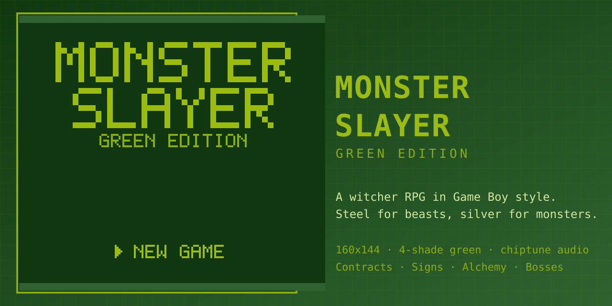

# MONSTER SLAYER — Green Edition

**A dark-fantasy witcher RPG rendered in authentic 4-shade Game Boy green.**

Take contracts in the village of Hollow Creek. Cull drowners in the reeds, lay a
grieving wraith to rest, and walk into the heart of the wood to face the thing
that wears a crown of antlers.

[](https://monster-slayer-ivory.vercel.app/)

[](LICENSE)
[](https://nextjs.org)
[](https://www.typescriptlang.org)
[](#%EF%B8%8F-testing)
[](https://monster-slayer-ivory.vercel.app/)

*Steel for beasts. Silver for monsters. Crowns for the witcher.*

</div>

---

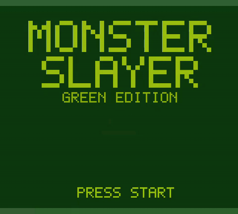

> Real gameplay capture — recorded headlessly with the game's own chiptune audio.
> The full 5-minute playthrough with sound is [below](#-watch-the-playthrough).

## 🐍 The Tale

The year is 1273. The war has burned the Northern kingdoms, and the roads crawl
with everything war leaves behind. Only witchers walk **toward** the monsters.

You are **Vesk of the School of the Serpent**. Your medallion hums. Hollow Creek
has posted work — and this time, the contracts are all fingers pointing at one
rotten truth in the Heart of Oldewood.

## ⚔️ Features

| | |
|---|---|
| 🗺️ **12 hand-built maps** | Hollow Creek village, four interiors, Mirelow Swamp, Oldewood, Weeping Graves, the Heart of Oldewood — plus the **Northern Reaches**: Fangtooth Pass, Crookback Bog, and ruined Kaer Serpen |
| 👹 **16 monsters to hunt** | Drowners, ghouls, wolves, nekkers, endrega, foglets, noonwraiths, rotfiends, barghests, water hags, a wraith — plus five bosses: the Werewolf, the Royal Griffin, the Arachas, the Leshen, and the endgame **Katakan** |
| 🏫 **5 witcher schools** | Choose your build at character creation: Serpent (balanced), Wolf (signs), Bear (tank), Cat (glass cannon), Griffin (hybrid) — each with stat mods and perks |
| 📈 **Skill point training** | Every level grants a point — spend it on Vitality, Stamina, Swordplay or Armor in the TRAINING screen |
| ⚔️ **Pokémon-style battles** | Turn-based combat with **two swords**: steel for beasts of flesh, silver for monsters — plus crits, stuns, poison, shields and a fifth monster class (insectoids) with its own oil |
| 🔥 **4 witcher Signs** | IGNI (fire), AARD (telekinetic shock + stun), QUEN (damage shield), AXII (hex) — fueled by stamina, discounted by school |
| 🧪 **Alchemy & toxicity** | Swallow, Thunderbolt and White Honey potions, four blade oils, and a toxicity meter that punishes over-drinking |
| 📜 **12 contracts & moral choices** | A notice board economy of quests — including the Weeping Widow, where you choose between mercy and coin |
| 🎒 **Witcher's kit** | Bestiary, quest log, 4 shops, tiered gear reforging, save/continue |
| 🏠 **Gen-1 style buildings** | Thatched shingle roofs with courses, stitches and a ridge cap, eave shadow dither, timber-framed plaster walls, cross-mullion windows with a lit pane, plank doors with lintels and steps, brick chimneys with drifting smoke, and **four hanging shop signs** (griffin, hammer, leaf, rune) that tell the identical facades apart — all wrapped in a **grounded silhouette**: ink side edges, a stone base course with an ink plinth, and a cast ground shadow so houses sit *on* the lawn instead of blending into it |
| 🎞️ **GB-feel animation pass** | Hand-dithered terrain with per-tile variants, water shores & foam, swaying flowers/reeds, bubbling cauldron, candle-flicker shrine, crawling thorns, hearth fire with rising sparks, NPC glide-walk with step-bob, reeds rustle, dialog slide-open, encounter flash + ink fades, battle juice (HP drain, attack lunge, slash streaks, faint), pixel-perfect integer-scaled canvas |
| 🧙 **A witcher who reads as one** | White swept hair, cat eyes, a readable wolf medallion, pommels breaking the silhouette — and **X-crossed silver-over-steel scabbards** on the back view, a connected scabbard diagonal in profile, a true alternating-gait walk cycle, idle breathing/blinking, and a school-tinted scarf |
| 🖥️ **Full DMG shell** | Play inside a lovingly over-engineered Game Boy: working D-pad, A/B, START/SELECT, battery LED and speaker grille |
| 🎵 **All-original chiptune** | **16-track soundtrack** on an authentic 4-channel DMG-style engine (two pulse channels with duty cycles, wave bass, noise drums) + 20 sound effects — synthesized live, zero audio files |
| 🖱️ **Keyboard, mouse & touch** | Arrows/WASD/Z/X/M on desktop, **full mouse support** (click-to-move with pathfinding, clickable menus, right-click cancel, wheel scroll), on-screen buttons on mobile |

## 🎬 Watch the playthrough

A complete, real run of the game — every battle fought live, every choice made
on camera, recorded with the game's own synthesized soundtrack.

| Chapter | Length | Watch |
|---|---|---|
| 🎞️ **Full playthrough** | 7:24 | [`playthrough-full.mp4`](docs/media/playthrough-full.mp4) |
| 1 · Title, school select & intro | 0:15 | [`chapter-1-title-and-intro.mp4`](docs/media/chapter-1-title-and-intro.mp4) |
| 2 · Hollow Creek — board, elder, shops | 1:48 | [`chapter-2-hollow-creek.mp4`](docs/media/chapter-2-hollow-creek.mp4) |
| 3 · First hunt — swamp battle & menus | 1:24 | [`chapter-3-first-hunt.mp4`](docs/media/chapter-3-first-hunt.mp4) |
| 4 · The Weeping Widow — a moral choice | 0:42 | [`chapter-4-the-weeping-widow.mp4`](docs/media/chapter-4-the-weeping-widow.mp4) |
| 5 · Heart of Oldewood — bosses & ending | 3:11 | [`chapter-5-heart-of-oldewood.mp4`](docs/media/chapter-5-heart-of-oldewood.mp4) |

*(Click a clip — GitHub plays MP4s in the browser.)*

## 🖼️ Gallery

| Title | The world |
|---|---|
| 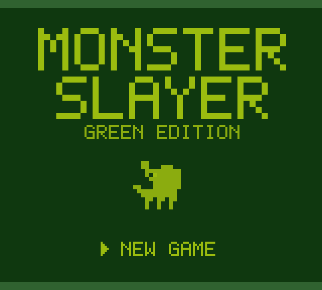 | 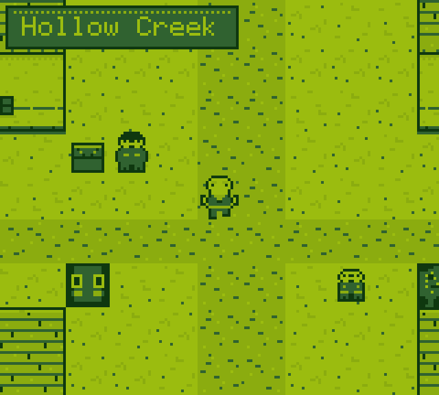 |
| *The title screen.* | *Hollow Creek, the village hub.* |

| Contracts | Alchemy |
|---|---|
| 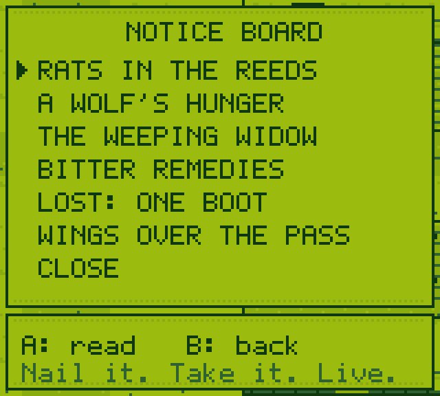 | 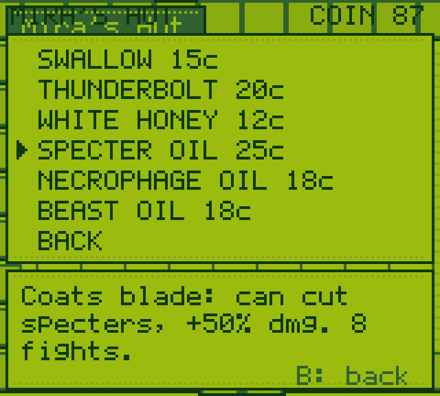 |
| *The notice board pays in crowns.* | *Mira's hut: potions, oils, salves.* |

| Turn-based combat | Signs |
|---|---|
| 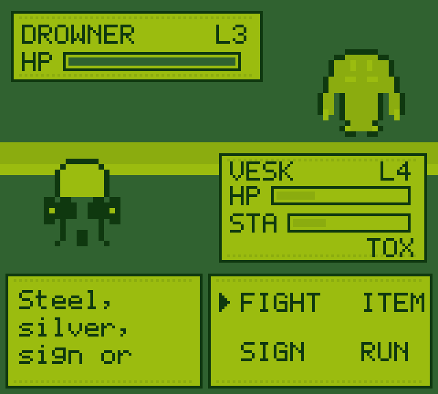 | 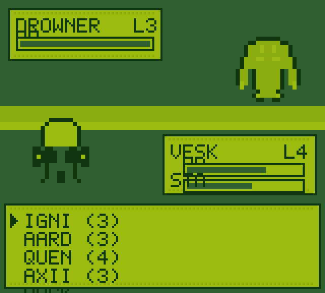 |
| *Steel or silver — choose the right blade.* | *Four Signs fueled by stamina.* |

| IGNI! | The final boss |
|---|---|
| 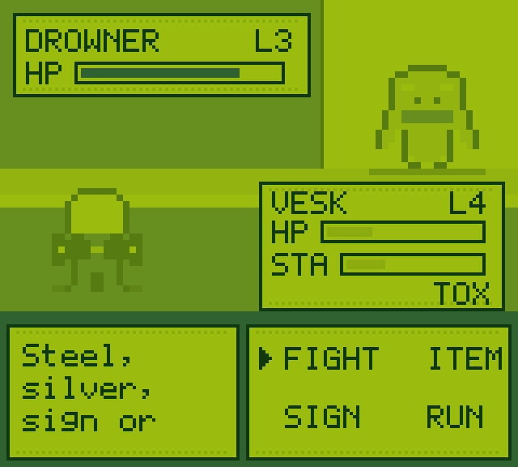 | 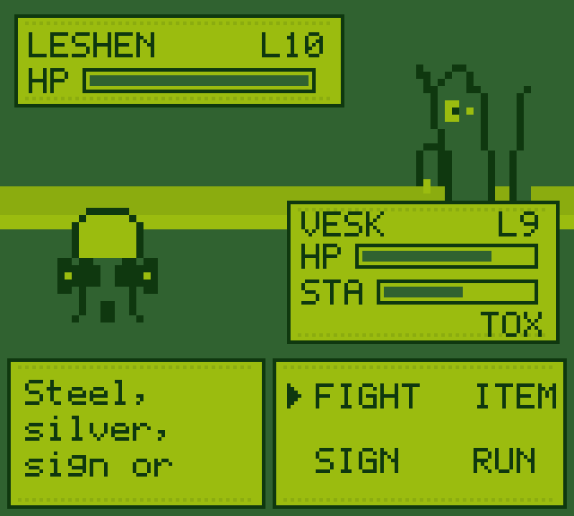 |
| *A torrent of flame — curses burn.* | *The Leshen of Oldewood.* |

| A moral choice | The dark places |
|---|---|
| 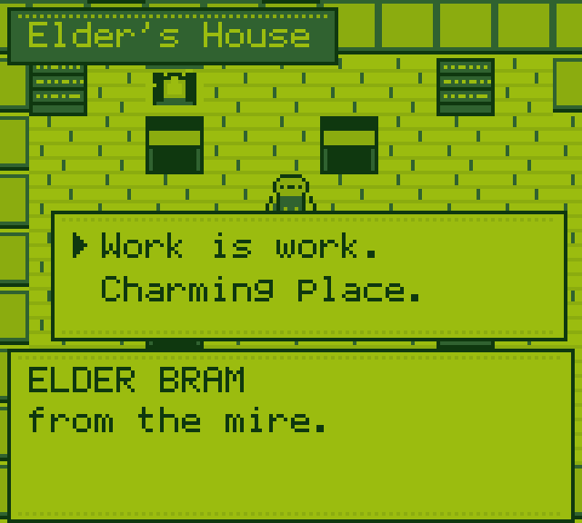 | 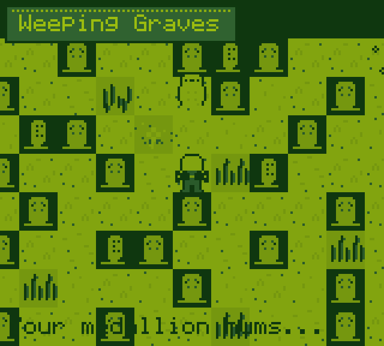 |
| *Every contract ends with a decision.* | *Weeping Graves after sundown.* |

| Bestiary | The chronicle |
|---|---|
| 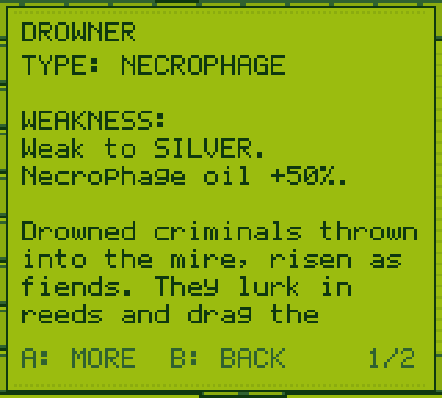 | 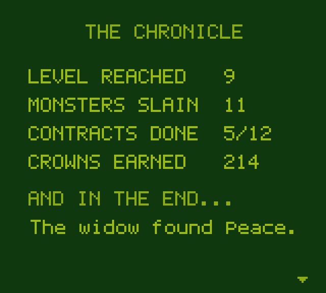 |
| *Know your monster, know its weakness.* | *How Hollow Creek remembers you.* |

## 🏔 The Northern Reaches

*The v2 expansion: three new regions, three new bosses, and the ruins of the
Serpent School itself.*

| Choose your school | Train your witcher |
|---|---|
| 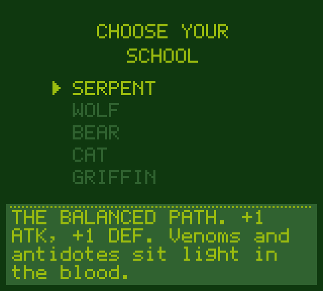 | 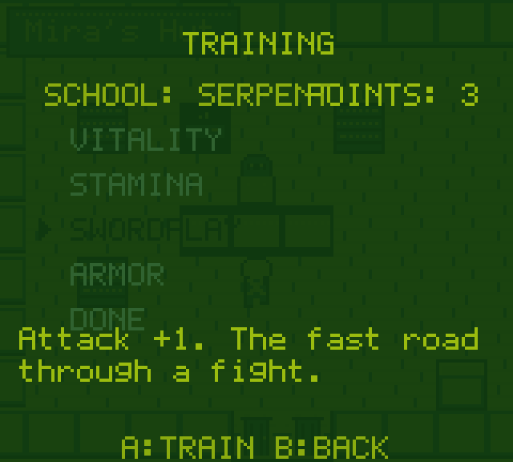 |
| *Five schools, five builds.* | *Spend level-up points your way.* |

| Fangtooth Pass | Crookback Bog |
|---|---|
| 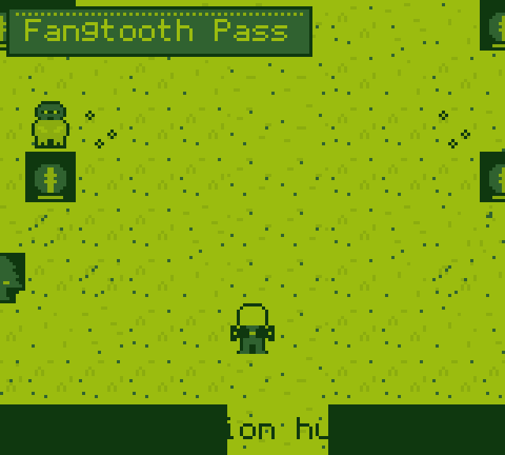 | 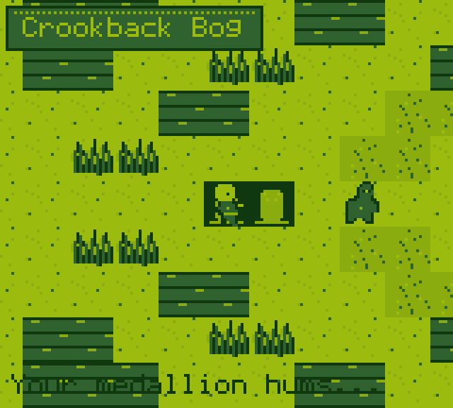 |
| *Barghests on the scree, a griffin on the ridge.* | *Old Kettle trades in the deep mire.* |

| Kaer Serpen | The endgame boss |
|---|---|
| 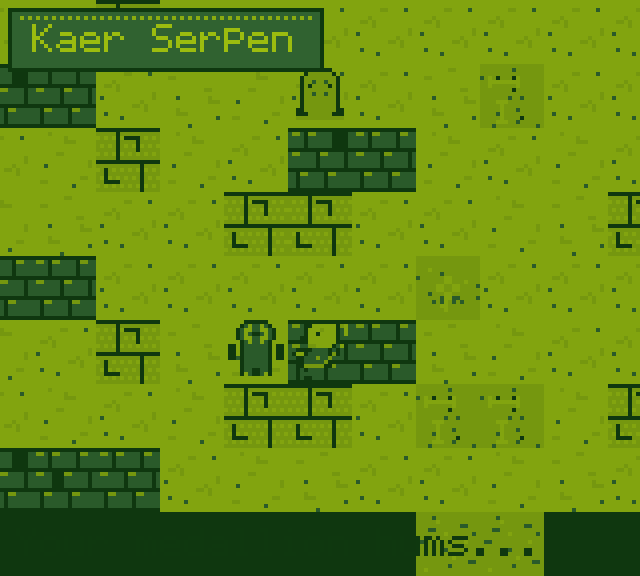 | 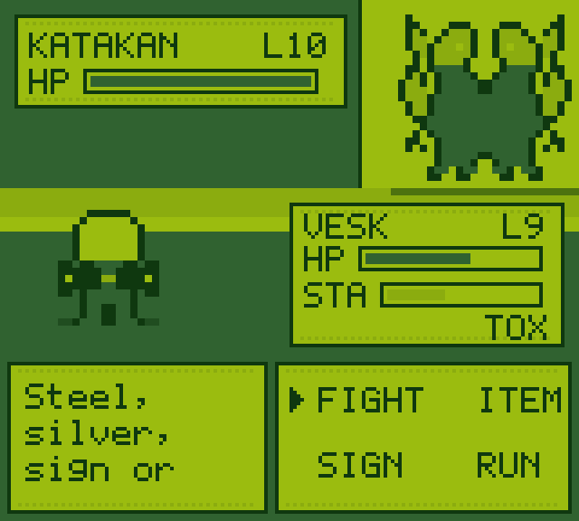 |
| *The dead School keeps a pale ghost.* | *The Katakan wears witcher faces.* |

<details>
<summary><b>👹 More of the bestiary & the Royal Griffin</b></summary>

| New bestiary | Royal Griffin |
|---|---|
| 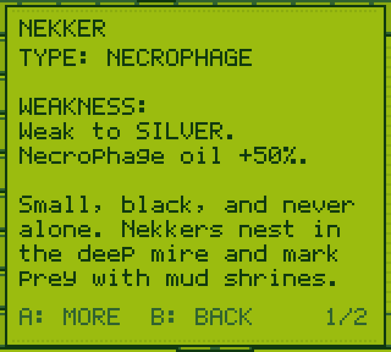 | 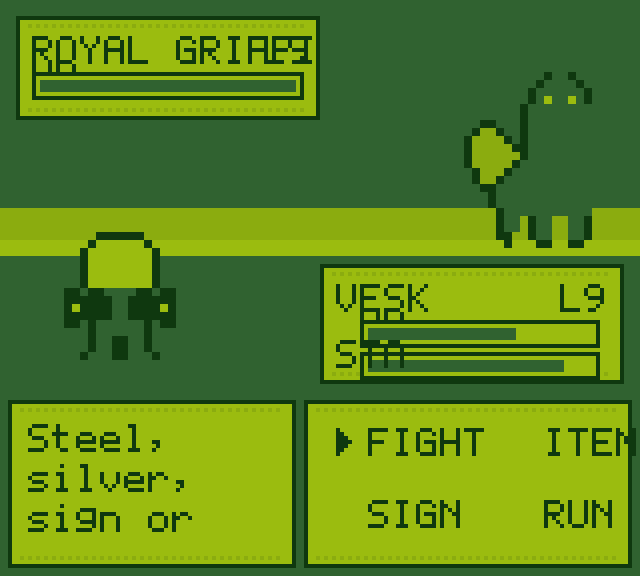 |
| *Barghest — ember-eyed hound of the pass.* | *Wings like torn sailcloth.* |

</details>

<details>
<summary><b>🕹 The whole handheld, on desktop and mobile</b></summary>

| Desktop | Mobile |
|---|---|
| 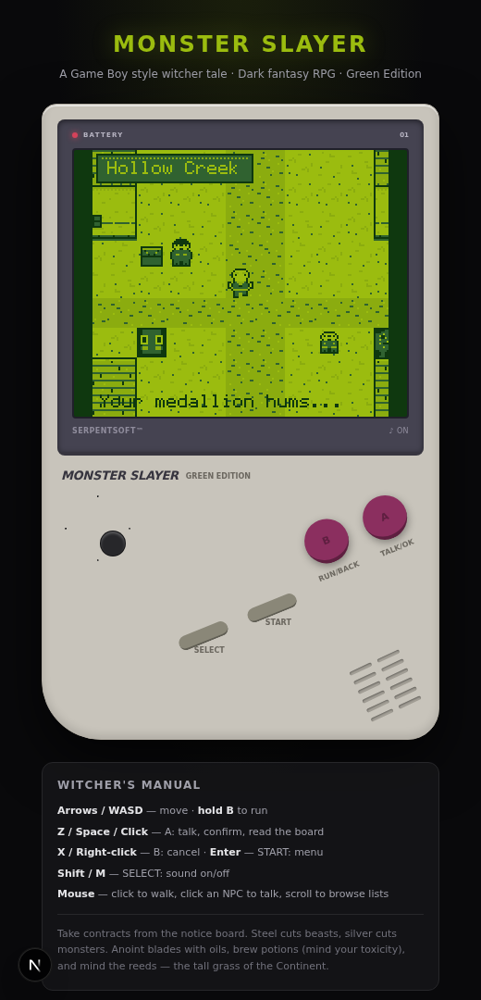 | 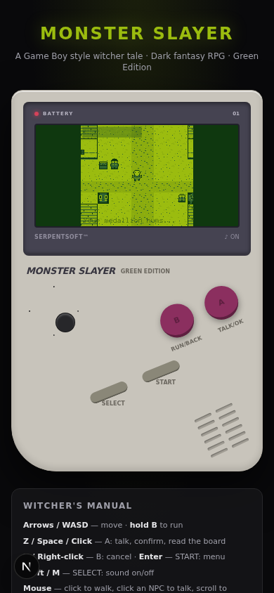 |

</details>

## 🎮 How to play

| Input | Action |
|---|---|
| **Arrow keys / WASD** | Move (grid-based, camera follows) · **click** any tile to auto-walk there |
| **Z** / **Space** / **Click** | **A** — talk, confirm, read the board, advance text · **click an NPC** from any distance to walk over and talk |
| **X** / **Right-click** | **B** — cancel · hold while moving to **run** |
| **Enter** | **START** — open the witcher's menu |
| **Shift** / **M** | **SELECT** — sound on/off |
| **Mouse wheel** | Browse any list — menus, bestiary, shops, contracts |
| **On-screen buttons** | Full touch controls on mobile |

Every screen is fully playable by mouse alone or keyboard alone — full input
parity, the way it should be.

**Survival 101:** read the notice board, take contracts, and let the bestiary
teach you which blade and which oil each monster fears. Hold **B** to run, talk
to everyone twice, and remember — the tall reeds rustle before they strike.

## 🚀 Run it locally

**Or don't — it's deployed: [monster-slayer-ivory.vercel.app](https://monster-slayer-ivory.vercel.app/).**

```bash
# install
npm install

# play (dev server)
npm run dev
# → http://localhost:3000

# production build
npm run build && npm start
```

Requirements: Node 18+. No environment variables, no database — the whole game
is a single client-side canvas application with localStorage saves.

## 🧪 Testing

```bash
npm run typecheck   # strict TS, zero errors
npm run lint        # eslint, clean
npm run e2e         # 66-check browser E2E: title → schools → quests → bosses → ending → save → mouse → text pagination
```

The E2E suite (`scripts/e2e-test.sh`) drives the real game through its full
quest line — the wraith peace path, all five bosses, the ending, save files,
and the mouse/pointer layer — using the same input API a physical controller
would. Every string in the game is also width-audited against its box
geometry (`scripts/font-audit.cjs`), and long texts paginate instead of
clipping — no font is ever cut off or overflown anywhere in the game.

## 🎵 Soundtrack

Sixteen original compositions on the 4-channel engine — every note placed by
hand in tracker notation:

| Scene | Track | Feel |
|---|---|---|
| Title | *The Witcher's Road* | E-minor overture, the game's main theme |
| Hollow Creek | *Hollow Creek* | Warm C-major village air |
| The Sleeping Griffin | *The Sleeping Griffin* | 138 BPM tavern jig |
| Mirelow Swamp | *Mirelow* | Murky D-dorian crawl |
| Oldewood | *Oldewood Path* | Adventurous D-minor march |
| Weeping Graves | *Weeping Graves* | Sparse, mournful A-minor |
| Fangtooth Pass | *Fangtooth Sky* | Windswept C-minor climb |
| Kaer Serpen | *Kaer Serpen* | Fallen-majesty ruins theme |
| Heart of Oldewood | *Beneath the Roots* | Low drone before the Leshen |
| Battle | *Steel & Silver* | Driving A-phrygian |
| Boss · Werewolf | *Moonblood* | Heavy D-minor |
| Boss · Leshen | *Heart of Oldewood* | 168 BPM finale |
| Victory | fanfare | Non-looping ta-da |
| Defeat | sting | Descending game-over |
| Ending | *The Serpentine Path* | Title-theme reprise, resolved to G major |
| Shops | *Crowns & Curiosities* | Playful F-major |

## 🏗 Architecture

The game is ~8,000 lines of dependency-free TypeScript. Every sprite, tile,
font glyph and sound wave is generated in code — there are **zero art assets
and zero audio files**.

| Module | Lines* | Responsibility |
|---|---|---|
| [`engine.ts`](src/game/engine.ts) | 1,525 | State machine (16 modes), grid movement + camera, BFS click-to-walk, NPC wander + glide, encounters, warps, scene fades, save/load, endings |
| [`sprites.ts`](src/game/sprites.ts) | 1,709 | Pixel-art tileset (55+ tiles incl. chimney/signs/hearth/crate/woodpile/haystack, per-position variants, animated water/flowers/reeds/cauldron/shrine/thorns/hearth/chimney), witcher sprite (4 dirs × 2 frames, alternating gait + X-scabbards), 12 NPCs |
| [`engineMenus.ts`](src/game/engineMenus.ts) | 742 | START menu, bag, stats, contracts, training, bestiary, shops, notice board, ending + pointer hit-testing |
| [`battle.ts`](src/game/battle.ts) | 783 | Turn-based combat: swords, oils, signs, Quen, toxicity, poison, crits, boss AI + battle juice (HP drain, lunge, faint) + pointer menus |
| [`dialogue.ts`](src/game/dialogue.ts) | 726 | Branching dialogues with conditions, actions and Witcher-style choices |
| [`audio.ts`](src/game/audio.ts) | 728 | 4-channel DMG-style chiptune engine: 16 tracks + 20 SFX, live-synthesized |
| [`maps.ts`](src/game/maps.ts) | 490 | 12 maps, warps, NPCs, pickups, encounter tables |
| [`data.ts`](src/game/data.ts) | 422 | Monsters, signs, items, schools, shops, quests |
| [`monstersGfx.ts`](src/game/monstersGfx.ts) | 402 | 16 battle sprites (bosses are true 48px, with backdrop card grounding) |
| [`page.tsx`](src/app/page.tsx) | 333 | DMG device shell, keyboard + mouse + touch input layer, integer-scaled pixel-perfect canvas |
| [`font.ts`](src/game/font.ts) | 183 | Hand-rolled 5×7 bitmap font (~90 glyphs) + word-wrap & pagination |
| [`render.ts`](src/game/render.ts) | 113 | GB window frames, HP bars (labels never overdrawn), right-aligned text, cached big-glyph titles |
| [`constants.ts`](src/game/constants.ts) | 62 | The 4-shade DMG palette + tuning |

*\*plus the DMG device shell UI in [`page.tsx`](src/app/page.tsx).*

```
src/
├── app/
│   ├── page.tsx        # Game Boy shell UI (React) + game bootstrap
│   ├── layout.tsx      # Metadata & fonts
│   └── api/route.ts    # /api — health check
└── game/               # the entire engine (see table above)
```

### 🎬 About the capture pipeline

The playthrough video is **not** an emulator reel — it was recorded by a
headless browser playing the real game with real inputs
([`scripts/media/`](scripts/media/)):

1. `record-playthrough.cjs` — drives the game via its input API (BFS-pathed
   walking, menu navigation, live battles) while a patched Web Audio graph is
   tapped into a `MediaRecorder` alongside a ×4 nearest-neighbor canvas stream.
2. `produce-media.sh` — ffmpeg post: loudness-normalized H.264/AAC MP4,
   chapter cuts from timestamped scene marks, and a palette-optimized GIF.
3. `screenshot-tour.cjs` — staged scene setups captured at native 160×144 and
   upscaled crisply to 640×576.

## 🙏 Credits & fair use

A fan-made homage to **The Witcher** (CD Projekt Red) and the monster-catching
handhelds we grew up with (Nintendo / Game Freak). Not affiliated with, endorsed
by, or connected to either. All code, pixel art, writing and music in this
repository are original works.

**Monster Slayer — Green Edition** · built by [kanishka-namdeo](https://github.com/kanishka-namdeo)

## 📜 License

[MIT](LICENSE) — do what thou wilt, witcher.
